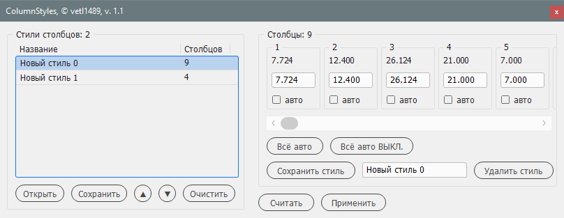

# ColumnStyles

*[English](README.md) • [Русский](README-ru.md)*

Менеджер для создания стилей ширины столбцов таблиц для Adobe InDesign. Функционал вдохновлен скриптом [AutoSpalte2.jsx](https://github.com/gsingelmann/indd_autocolumn).

Стили таблиц и ячеек в InDesign позволяют контролировать многое во внешнем виде таблиц, но не ширину столбцов. При верстке документов с большим количеством однотипных таблиц установка ширины столбцов каждой таблицы производится вручную. Данный скрипт помогает автоматизировать эту операцию.

## Возможности

- считывание параметров таблицы и сохранение ширины её столбцов в стиль;
- редактирование и удаление стилей колонок;
- сохранение набора стилей в файл `*.cstyle`;
- загрузка ранее сохраненных наборов стилей;
- восстановление набора стилей при закрытии скрипта или InDesign;
- установка автоматической ширины для выбранных столбцов;
- применение стиля к выбранной таблице.

## Работа со скриптом

Установите курсор в ячейку таблицы или выделите всю таблицу целиком. Нажав кнопку `Считать`, мы получаем в текущий стиль все размеры колонок таблицы. Выделив отдельные столбцы или ячейки таблицы и считав их, в текущий стиль попадут размеры только этих столбцов.

Теперь этот стиль можно изменить в полях ввода ширины каждого столбца и, изменив название, сохранить нажав кнопку `Сохранить стиль`. Стиль записывается в список стилей. Выделив сохраненный стиль, кнопкой `Применить` применяем стиль к другой выделенной таблице или ее части.

Выделенный стиль можно изменить и сохранить изменения в тот же стиль кнопкой `Сохранить стиль`. Или удалить из списка стилей кнопкой `Удалить стиль`.

Кнопки `Всё авто` и `Всё авто ВЫКЛ` устанавливают и выключают автоширину для всех колонок. Подробнее об автоширине читайте ниже.

### Работа со списком стилей

Кнопка `Сохранить` позволяет сохранять список стилей в файл `*.cstyle`.

Кнопкой `Открыть` можно загрузить в скрипт ранее сохраненный файл с набором стилей.

Кнопками `▲` и `▼` можно перемещать выбранный стиль в списке вверх и вниз и упорядочить список стилей.

Кнопка `Очистить` удаляет все стили из списка.

## Автоматическая ширина столбцов

При применении стиля без автоширины размеры столбцов таблицы фиксированы и равны значениям, заданным в полях ввода их ширины. Общая ширина таблицы равна сумме этих значений.

Когда для одного или более столбцов задаётся автоширина, предустановленное значение игнорируется. Применяя такой стиль с автошириной, исходная ширина выбранной таблицы **не меняется**, а ширина столбцов с автошириной вычисляется (и распределяется поровну, если таких столбцов несколько) как разница исходной ширины таблицы и всех фиксированных столбцов.

## Ограничения

Максимальное количество столбцов, отображаемых в скрипте при считывании таблицы или при выборе стиля, зависит от разрешения экрана. Группа, в которую добавляются ячейки-панели для редактирования каждой из колонок, принимает максимальный размер ~90-99% (в зависимости от версии InDesign) от ширины экрана (или общей ширины экранов, если их несколько). При разрешении экрана FullHD (ширина 1980 px) максимальное количество отображаемых столбцов равно 23.

Для изменения максимального количества отображаемых колонок нужно изменить `Sizes.UI_COLUMN_WIDTH` и `Sizes.UI_COLUMN_MARGIN`. Меньше значения — уже ячейки-панели, отображается больше колонок.

`Sizes.UI_COLUMN_PANEL_COUNT` позволяет настроить видимое количество столбцов.

---

Работа скрипта проверена на InDesign CS5-2023.
