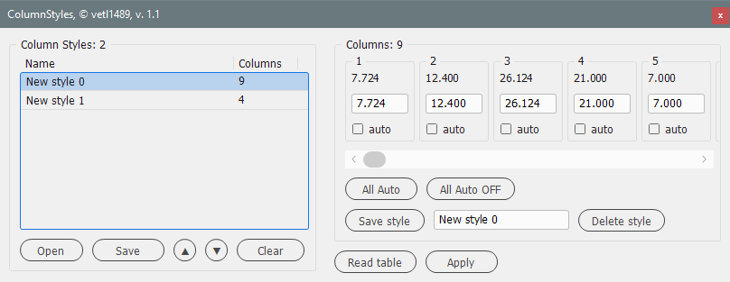

# ColumnStyles

*[English](README.md) • [Русский](README-ru.md)*

Manager for creating table column width styles for Adobe InDesign. The functionality is inspired by the script [AutoSpalte2.jsx](https://github.com/gsingelmann/indd_autocolumn).

Table and cell styles in InDesign let you control a lot about how tables look, but not the width of columns. When laying out documents with many tables of the same type, setting the width of the columns of each table is done manually. This script helps to automate this process.

## Features

- reading the table parameters and saving the width of its columns in the style;
- editing and deleting each column style;
- saving a set of styles to a file `*.cstyle`;
- loading previously saved style sets;
- restoring the style set after closing the script or InDesign;
- setting automatic width for selected columns;
- applying style to a selected table.

## Working with the script

Place the cursor in a table cell or select the entire table. By clicking the `Read table` button, we get all the sizes of the table columns into the current style. By selecting individual table columns or cells and reading them, only those column sizes will be included in the current style.

Now this style can be changed in the input fields for the width of each column and, after changing the name, saved by clicking the `Save style` button. The style is written to the style list. Having selected the saved style, use the `Apply` button to apply the style to another selected table or part of it.

You can change the selected style and save changes to the same style using the `Save style` button. Or remove from the list of styles using the `Delete style` button.

The `All Auto` and `All Auto OFF` buttons set and turn off the autowidth for all columns. Read more about autowidth below.

### Working with a list of styles

The `Save` button allows you to save the list of styles to the `*.cstyle` file.

Using the `Open` button you can load a previously saved file with a set of styles into the script.

Using the `▲` and `▼` buttons you can move the selected style up and down in the list and organize the list of styles.

The `Clear` button removes all styles from the list.

## Auto-width

When applying a style without auto-width, the sizes of the table columns are fixed and equal to the values specified in the input fields for their width. The total width of the table is equal to the sum of these values.

When autowidths are set for one or more columns, the preset value is ignored. Applying a style like this with autowidth, the original width of the selected table does **not change**, and the width of autocolumns is calculated (and is distributed equally if there are multiple such columns) as the difference between the width of the same table and the sum of the widths of all fixed columns.

## Restrictions

The number of columns displayed in the script when reading a table or selecting a style depends on the screen resolution. The group into which panel cells are added to edit each of the columns takes a maximum size of ~90-99% (depending on the version of InDesign) of the screen width (or the total screen width, if there are several). With FullHD screen resolution (width 1980 px), the maximum number of columns displayed is 23.

To change the number of columns displayed, you need to change `UI.COLUMN_WIDTH` and `UI.COLUMN_MARGIN`. Less value - already cell-panels, more columns are displayed.

`UI.COLUMN_PANEL_COUNT` allows you to customize the visible number of columns.

---

The script was tested on InDesign CS5-2023.

## Changelog

### v. 1.1

- The code for working with configuration files has been rewritten.
- Various minor fixes.
